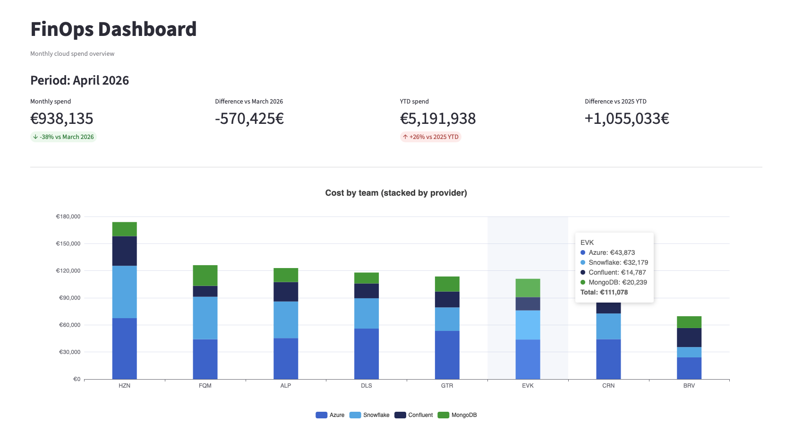

# FinOps Teams Dashboard
> [!NOTE]  
> This is still in development. Treat it as a POC.



Simple Streamlit dashboard to track monthly cloud spend by team across:
- Azure
- Snowflake
- MongoDB
- Confluent

Current phase uses simulated data.

## Run

```bash
cd streamlit-finops-dashboard
python3 -m venv .venv
source .venv/bin/activate
pip install -r requirements.txt
streamlit run app.py
```

## Project layout

- `app.py`: main executive dashboard
- `pages/`: focused drill-down pages
- `finops_dashboard/config`: colors and labels
- `finops_dashboard/data`: data generation, loading and transforms
- `finops_dashboard/ui`: reusable UI components

## Phase 2 (planned)

- Plug a PostgreSQL database as the main data source
- Use an automation-as-code tool to collect costs from each platform
- Format and store data in FinOps FOCUS structure for aligned reporting
